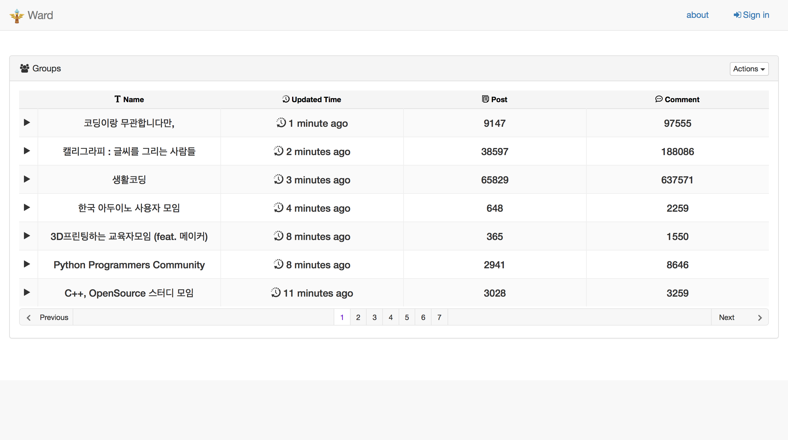
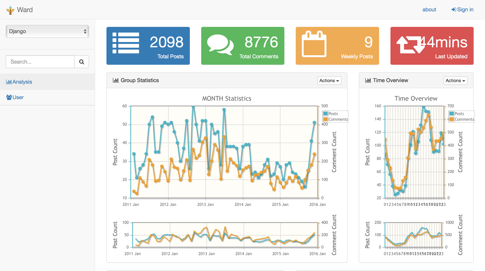
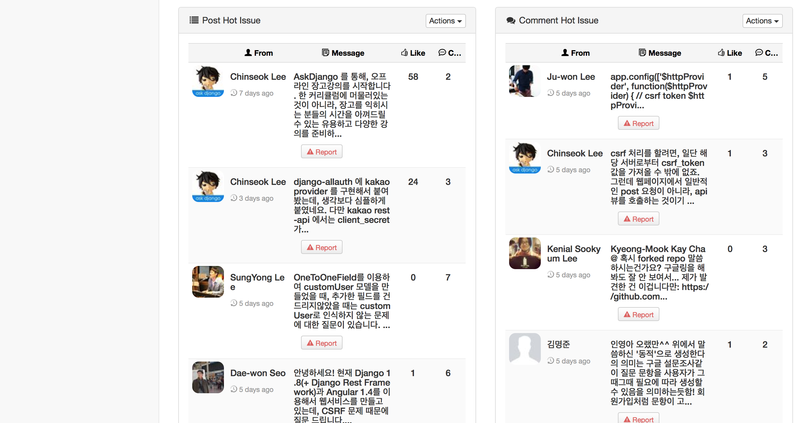
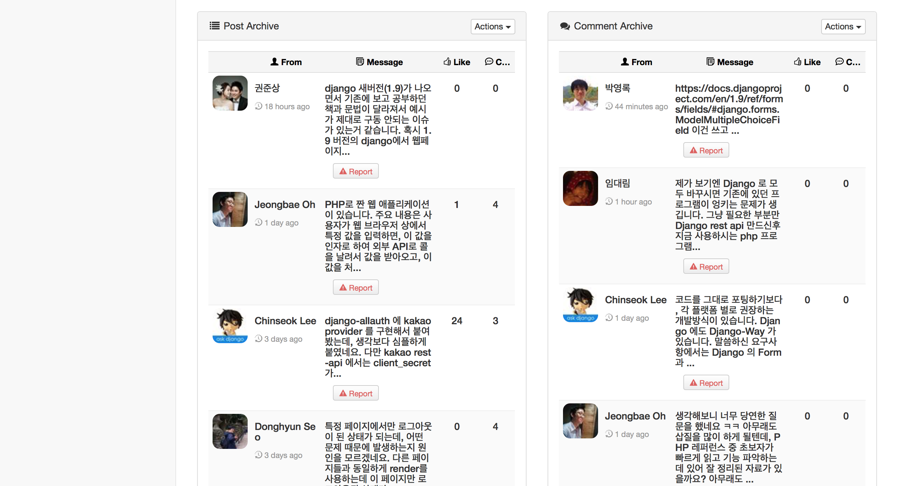
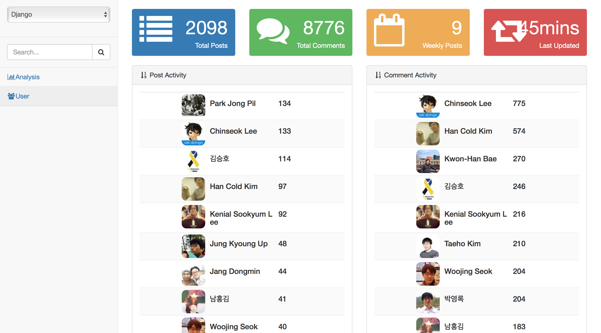
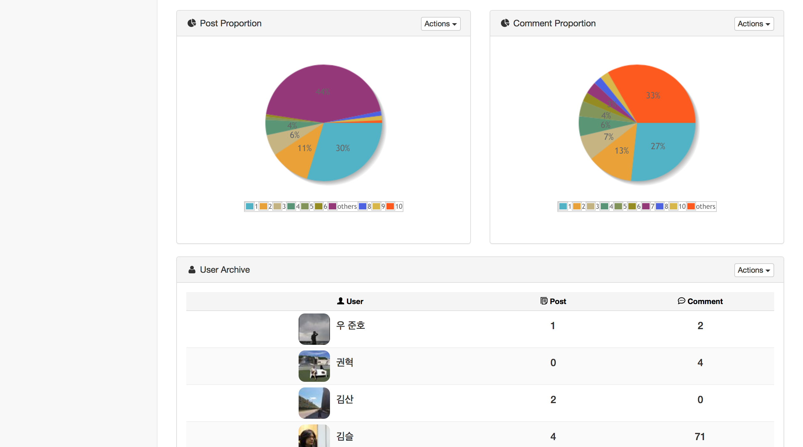
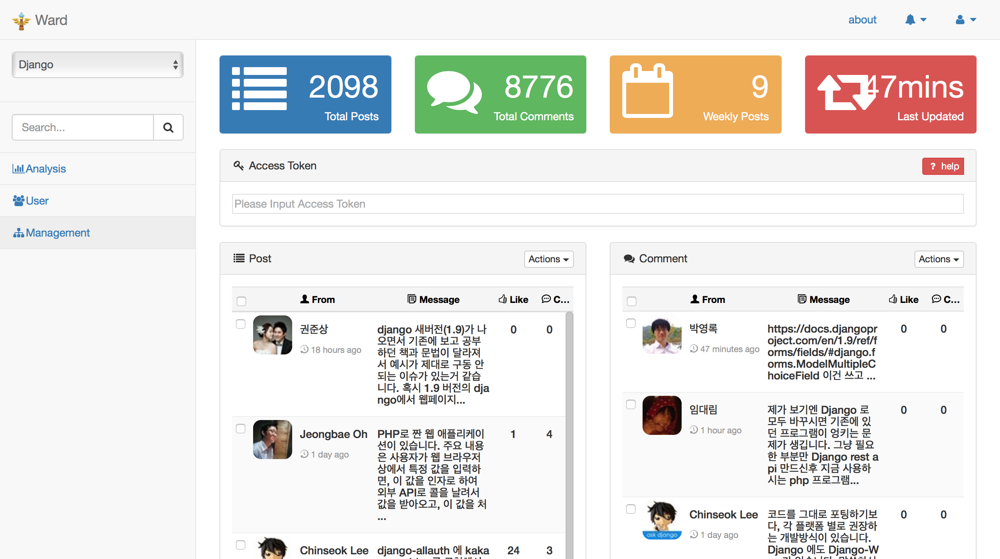
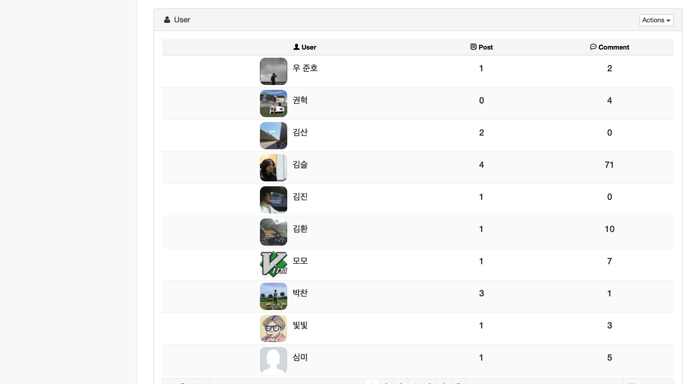
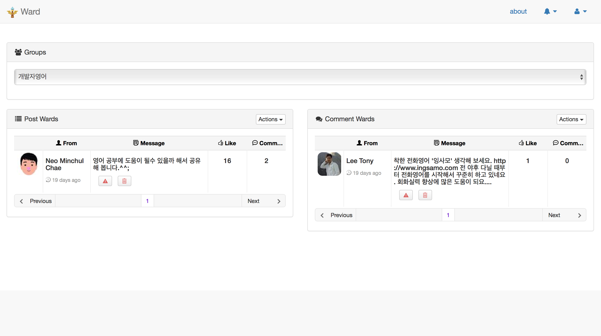

[](https://waffle.io/egaoneko/ward)

# [Ward](http://pjwards.com)
Ward는 Facebook의 Group에 대한 정보 및 분석을 제공하는 사이트입니다.

개발과 관련된 Facebook Group의 게시글들을 보다보면, 특정 게시글에 대하여 달려질 댓글들에 대한 알림을 받기 위해 “와드를 박습니다.”라는
댓글을 작성하거나 좋아요를 누르는 것을 볼 수 있었습니다. 이런 현상을 보며, Facebook Group의 타임라인 저편으로 사라져 찾아보기 힘든
많은 좋아요나 댓글이 달린 글들을 모아 보고 싶다는 생각을 기반으로 만들어진 사이트입니다.

이를 위해 Facebook Graph API를 이용하여 그룹에 대한 데이터를 수집하여 저장하고, 이에 대한 다양한 정보를 보여주는 기능과
관심있는 게시글이나 댓글들을 저장하여 간편하게 확인할 수 있는 기능을 제공합니다.
또한 그룹 관리자들이 Facebook Group에 올라오는 스팸들을 지우기 위해 많은 시간을 들이고 있는데, 게시글에 대한 일괄 삭제 기능을 제공하고 있으며,
추후 게시글을 분석하여 스팸에 대한 알림 등의 추가 기능을 구현할 예정입니다.


## 필요한 도구들

#### Back-End

* python (tested with version 3.5) ([python](https://www.python.org), [Python License](./NOTICE/LICENSE.python))
* django (tested with version 1.8.5) ([django](https://www.djangoproject.com), [BSD License](./NOTICE/LICENSE.django))
* celery (tested with version 3.1.18) ([celery](http://www.celeryproject.org), [BSD License](./NOTICE/LICENSE.celery))
* django-celery (tested with version 3.1.17) ([django-celery](https://pypi.python.org/pypi/django-celery), [BSD License](./NOTICE/LICENSE.django-celery))
* facebook-sdk (tested with version 1.0.0a0) ([facebook-sdk](https://github.com/pythonforfacebook/facebook-sdk), [Apache License 2.0](./NOTICE/LICENSE.facebook-sdk))
* mezzanine (tested with version 4.0.1) ([mezzanine](http://mezzanine.jupo.org), [BSD License](./NOTICE/LICENSE.mezzanine))
* django-rest-framework (tested with version 3.3.0) ([django-rest-framework](http://www.django-rest-framework.org), [BSD License](./NOTICE/LICENSE.django-rest-framework))
* markdown (tested with version 2.6.3) ([markdown](https://pypi.python.org/pypi/Markdown), [BSD License](./NOTICE/LICENSE.markdown))
* django-filter (tested with version 0.11.0) ([django-filter](https://github.com/alex/django-filter), [BSD License](./NOTICE/LICENSE.django-filter))
* beautifulsoup4 (tested with version 4.4.1) ([beautifulsoup4](http://www.crummy.com/software/BeautifulSoup/), [MIT License](./NOTICE/LICENSE.beautifulsoup4))
* lxml (tested with version 3.5.0) ([lxml](http://lxml.de), [BSD License](./NOTICE/LICENSE.lxml))
* django-registration (tested with version 2.0.2) ([django-registration](https://github.com/macropin/django-registration), [BSD License](./NOTICE/LICENSE.django-registration))
* JPype1-py3 (tested with version 0.5.5.2) ([JPype1-py3](https://pypi.python.org/pypi/JPype1-py3), [Apache License 2.0](./NOTICE/LICENSE.jpype1-py3))
* konlpy (tested with version 0.4.4) ([konlpy](http://konlpy.org/ko/v0.4.3/), [GPL v3](./NOTICE/LICENSE.konlpy))
* django-allauth (tested with version 0.24.1) ([django-allauth](https://github.com/pennersr/django-allauth), [MIT License](./NOTICE/LICENSE.django-allauth))
* redis (tested with version 2.10.3) ([redis](http://redis.io), [BSD License](./NOTICE/LICENSE.redis))
* uwsgi (tested with version 2.0.11.2) ([uwsgi](https://github.com/unbit/uwsgi), [GPL v2](./NOTICE/LICENSE.uwsgi))
* pylibmc (tested with version 1.5.0) ([pylibmc](https://pypi.python.org/pypi/pylibmc), [BSD License](./NOTICE/LICENSE.pylibmc))
* psycopg2 (tested with version 2.6.1) ([psycopg2](http://initd.org/psycopg/), [LGPL with exceptions or ZPL](./NOTICE/LICENSE.psycopg2))


#### Front-End

* Bootstrap ([Bootstrap](http://getbootstrap.com), [MIT License](./NOTICE/LICENSE.bootstrap))
* Bootstrap Social ([Bootstrap Social](http://lipis.github.io/bootstrap-social/), [MIT License](./NOTICE/LICENSE.bootstrap-social))
* jQuery ([jQuery](https://jquery.com), [MIT License](./NOTICE/LICENSE.jquery))
* jQuery UI ([jQuery UI](https://jqueryui.com), [MIT License](./NOTICE/LICENSE.jquery-ui))
* Font Awesome ([Font Awesome](https://fortawesome.github.io/Font-Awesome/), [SIL OFL 1.1, MIT License](./NOTICE/LICENSE.fontawesome))
* Font Awesome Animation ([Font Awesome Animation](https://github.com/l-lin/font-awesome-animation), [MIT License](./NOTICE/LICENSE.fontawesome-animation))
* JUI ([JUI](http://jui.io/ko/index.php), [MIT License](./NOTICE/LICENSE.jui))
* Start Bootstrap Creative ([Start Bootstrap](http://www.startbootstrap.com), [Apache License 2.0](./NOTICE/LICENSE.startbootstrap))
* Start Bootstrap SB Admin 2 ([Start Bootstrap](http://www.startbootstrap.com), [Apache License 2.0](./NOTICE/LICENSE.startbootstrap))
* Bootstrap Login Form ([AZMIND](http://azmind.com/2015/04/19/bootstrap-login-forms/), [MIT License](./NOTICE/LICENSE.azmind))
* html2canvas ([html2canvas](https://html2canvas.hertzen.com), [MIT License](./NOTICE/LICENSE.html2canvas))
* jqPlot ([jqPlot](http://www.jqplot.com), [GPL v2, MIT License](./NOTICE/LICENSE.jqplot))


#### Etc

* PostgreSQL ([PostgreSQL](http://www.postgresql.org))
* Redis ([Redis](http://www.redis.io))
* Node.js ([Node.js](https://nodejs.org/en/))
* Bower ([Bower](http://bower.io))


## 설치방법

##### Docker의 경우

와드는 Docker를 사용하고 있으며, 이를 이용하여 손쉽게 설치할 수 있습니다.
Docker를 더 자세히 알고 싶으시면, 이 [사이트](https://docs.docker.com)를 방문해 주세요.

```bash
cd [product_forder]
docker build -t=ward .
docker run --name ward -it -p 80:80 -v /var/log/ward:/var/log ward:latest
```


##### Mac의 경우

```bash
pip install -r requirements.txt
brew install redis
brew install node
npm install bower

cd [product_forder]
bower install
cd [product_forder]/www
mkdir logs
python manage.py migrate
python manage.py createsuperuser

sudo redis-server
. run_celery.sh
```


##### Ubuntu의 경우

```bash
# JPype1-py3
sudo apt-get install default-jdk
sudo apt-get install g++ python3-dev

# lxml
sudo apt-get install python3-lxml
sudo apt-get install libxml2-dev libxslt-dev python-dev
sudo apt-get build-dep python3-lxml

# Pillow
sudo apt-get build-dep python-imaging
sudo apt-get install libjpeg8 libjpeg62-dev libfreetype6 libfreetype6-dev

# psycopg2
sudo apt-get install python-psycopg2
sudo apt-get install libpq-dev python-dev

# npm
sudo apt-get install -y python-software-properties python g++ make
sudo add-apt-repository ppa:chris-lea/node.js
sudo apt-get update
sudo apt-get install nodejs
sudo apt-get install npm
sudo npm install -g bower

# redis
sudo apt-get install redis-server

cd workspace
sudo chown www-data:www-data -R *

cd [product_forder]
bower install
cd [product_forder]/www
mkdir logs
python manage.py migrate
python manage.py createsuperuser

```

## 환경설정


#### setting.py 설정

반드시 `ward/wwww/fb_archive`안에 있는 `local_settings.py`파일을 자신의 환경에 맞추어 설정해 주세요.


#### OAuth Setting 설정

1. admin 페이지([http://localhost/admin](http://localhost/admin))에 있는 `Social application`카테고리에 들어갑니다.
2. `Add social application`를 클릭하고 `Name`에 facebook을, `Client id`에 app id를, `Secret key`에 app secret을 입력해주시면 됩니다.
더 자세한 사항은 이 [사이트](https://godjango.com/65-starting-with-django-allauth/)를 방문해 주세요


## 기타설정

### Pycharm

만약 Pycharm을 사용하시는 도중 `unresolved reference issue`가 발생하면 아래와 같은 방법으로 설정 해주세요.

1. `www`폴더를 오른쪽 클릭하여, `Mark Directory As`에 있는 `Source root`를 설정 해주세요.
2. Pycharm의 `Preferences...`에 `Build, Execution, Deployment` > `Console` > `Python Console`에 있는
`add source roots to PYTHONPATH`에 체크해 주세요.
3. 상단의 내용이 이해가 안가실경우 이 [사이트](http://stackoverflow.com/questions/21236824/unresolved-reference-issue-in-pycharm)를 방문해 주세요.
4. `Preferences...` > `Languages & Frameworks` > `Django`에 가셔서 `Django project root`를 상단의 첫번째 설정하셨던 `www`폴더로 설정해주시고
`Settings`를 `fb_archive/settings.py`로, `Manage script`를 `manage.py`로 설정해주세요


## 라이센스
[MIT 라이센스](./LICENSE)하에 배포 됩니다.


## 주요화면

### 그룹 목록 화면



### analysis 화면





### user 화면




### management 화면




### ward 화면



## 파일 및 폴더

    .
    ├── Dockerfile                                  : Docker 파일
    ├── LICENSE                                     : 라이센스
    ├── NOTICE                                      : 사용한 라이브러리들에 대한 라이센스
    ├── README.md                                   : README 파일
    ├── bower.json                                  : Bower 파일
    ├── conf                                        : 배포시에 사용되는 설정 파일
    ├── requirements.txt                            : 필요한 라이브러리 목록
    └── www                                         : 프로젝트 루트 폴더
        ├── analysis                                : 분석 앱 폴더
        │   ├── __init__.py
        │   ├── admin.py
        │   ├── analysis_core.py                    : 분석 관련 핵심 코드
        │   ├── migrations                          : migrations
        │   ├── models.py
        │   ├── spam_app.py                         : 스팸 관련 코드
        │   ├── tests.py
        │   ├── texts                               : 분석에 사용되는 문서
        │   ├── urls.py
        │   └── views.py
        ├── archive                                 : Facebook 그룹 기록 앱 폴더
        │   ├── __init__.py
        │   ├── admin.py
        │   ├── fb                                  : Facebook과 관련된 기능
        │   │   ├── __init__.py
        │   │   ├── fb_lookup.py                    : Facebook의 그룹 아이디 찾기 코드
        │   │   ├── fb_query.py                     : Facebook Graph API 쿼리 코드
        │   │   └── fb_request.py                   : Facebook Graph API 요청 클래스 코드
        │   ├── migrations
        │   ├── models.py
        │   ├── rest                                : Djang Rest Framework를 위한 설정 파일
        │   │   ├── __init__.py
        │   │   ├── pagination.py                   : Pagination을 위한 설정 파일
        │   │   └── serializer.py                   : Serializer를 위한 설정 파일
        │   ├── sql                                 : Raw SQL를 생성하기 위해 테스트해본 SQL
        │   ├── tasks.py                            : Facebook 그룹 데이터 수집 코드 (Celery 이용)
        │   ├── templates
        │   │   └── archive                         : Facebook 그룹 기록 앱 Templates
        │   │       ├── alert.html                  : 알림 Template
        │   │       ├── group                       : 그룹과 관련된 Templates
        │   │       │   ├── analysis.html           : 그룹 분석 Template
        │   │       │   ├── archive_header.html     : 그룹과 관련된 Templates의 Header 
        │   │       │   ├── list.html               : 그룹 리스트 Template
        │   │       │   ├── list_admin.html         : 그룹 리스트 관리자용 Template
        │   │       │   ├── management.html         : 그룹 관리 Template
        │   │       │   ├── search.html             : 그룹 검색 Template
        │   │       │   ├── sidebar.html            : 그룹과 관련된 Templates의 Sidebar
        │   │       │   └── user.html               : 그룹 사용자 Template
        │   │       ├── reports.html                : 스팸 신고 리스트 Template
        │   │       ├── user                        : 사용자와 관련된 Templates
        │   │       │   ├── user.html               : 사용자 Template
        │   │       │   └── user_header.html        : 사용자와 관련된 Templates의 Header
        │   │       └── wards.html                  : 와드 리스트 Template
        │   ├── tests.py
        │   ├── urls.py
        │   ├── utils                               : 도구 모음
        │   │   ├── __init__.py
        │   │   ├── data_utils.py                   : 데이타 관련된 유틸들
        │   │   └── date_utils.py                   : 날짜와 관련된 유틸들
        │   └── views.py                            : views (Django Rest Framework의 View들도 포함
        ├── deploy
        ├── fabfile.py
        ├── fb_archive                              : 프로젝트 기본 폴더
        │   ├── __init__.py
        │   ├── celery.py                           : Celery 설정
        │   ├── local_settings.py                   : 프로젝트 개인 설정
        │   ├── settings.py                         : 프로젝트 설정
        │   ├── urls.py 
        │   └── wsgi.py                             : wgsi 설정
        ├── manage.py
        ├── run_celery.sh                           : Celery 실행 쉘 파일
        ├── static
        │   ├── custom                              : 프로젝트 정적 파일 폴더
        │   │   ├── css                             : CSS 파일들
        │   │   │   ├── base.css                    : 공통 CSS 파일
        │   │   │   └── timeline.css                : Start Bootstrap의 Timeline CSS 파일
        │   │   └── js                              : Javascript 폴더
        │   │       ├── ajax.js                     : Ajax 관련 자바스크립트 파일
        │   │       ├── archive                     : Facebook 그룹 기록 앱에 관련된 자바스크립트 파일
        │   │       │   └── js
        │   │       │       ├── analysis.js         : 분석 자바스크립트 파일
        │   │       │       ├── archive.js          : Facebook 그룹 기록 공통 파일
        │   │       │       ├── group.js            : 그룹 자바스크립트 파일
        │   │       │       ├── management.js       : 관리 자바스크립트 파일
        │   │       │       ├── report.js           : 스팸 신고 자바스크립트 파일
        │   │       │       ├── search.js           : 검색 자바스크립트 파일
        │   │       │       ├── user.js             : 사용자 자바스크립트 파일
        │   │       │       └── ward.js             : 와드 자바스크립트 파일
        │   │       └── base.js                     : 기본 자바스크립트 파일
        │   ├── images                              : 이미지 폴더
        │   └── libraries                           : Bower로 설치하지 못하는 라이브러리들
        └── templates                               : 공통 Templates
            ├── about.html                          : 소개 Template
            ├── base.html                           : 공통 Template
            ├── errors                              : 오류 관련 Templates
            ├── registration                        : 회원가입 관련 Templates
            └── socialaccount                       : Oauth 관련 Templates
